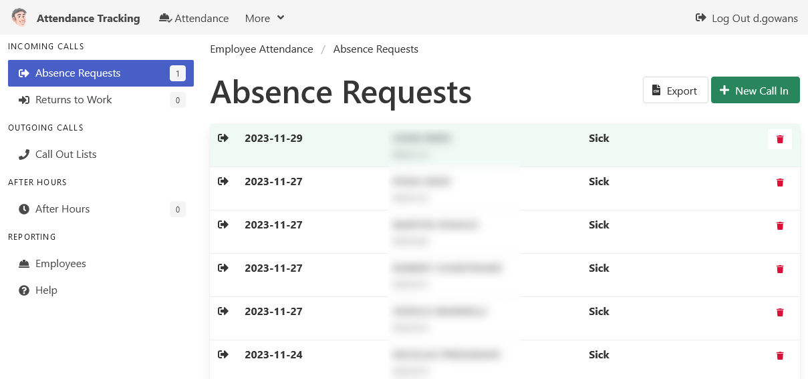

# MonTY

## ⭐ UNDER DEVELOPMENT ⭐

An application built for Public Works departments to
"**MON**itor and **T**rack **Y**our":

- Employee absences.
- Return to work calls.
- Call Out requests.
- After hours attendance.

## Features

- **Have the "full monty"**, but only if you want it.
  Enable as many features, or as few as you need.

- **Sync employees** with payroll systems.

- **Granular permissions** give users access to the areas they need,
  and not the areas they don't.

## Prerequisities

- **NodeJS 14 or better** to run the application.
- **Active Directory** for authentication.
- **SQL Server** for database storage.

### Optional

- **Avanti** payroll system for employee synchronization.

## About this Project

📘 **[User Documentation (In The Works)](https://cityssm.github.io/MonTY/docs/)**

- [Code of Conduct](CODE_OF_CONDUCT.md)
- [Contributing Guidelines](CONTRIBUTING.md)
- [Security Policy](SECURITY.md)
- [MIT Licence](LICENSE.md)

Although the system is quite niche, it's being released in an open source environment in hopes to pool developer resources from other municipalities looking to move away from older, legacy systems.

It is being shared to start the dialog among other municipalities and present an option to those who may be looking to refresh or upgrade their employee call tracking.

## More Projects from the City of Sault Ste. Marie

The City of Sault Ste. Marie has [several open source applications](https://cityssm.github.io/) available
for managing municipal operations.

- **[General Licence Manager](https://github.com/cityssm/general-licence-manager)** - An application built to manage the general licences issued by municipalities.
- **[Lottery Licence Manager](https://github.com/cityssm/lottery-licence-manager)** - An application for managing AGCO's municipal lottery licensing requirements in Ontario.

[Browse our GitHub account](https://github.com/cityssm/) for more of the City's offerings.
