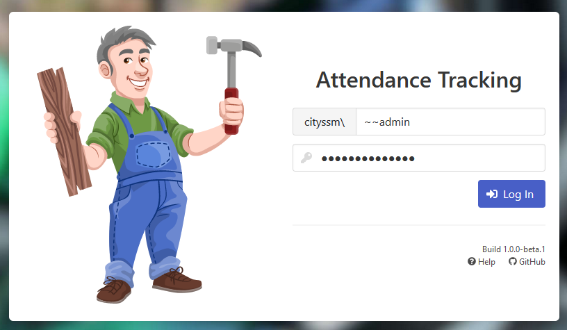

[Help Home](https://cityssm.github.io/MonTY/docs/)

# Admin - Logging Into a New Install

As part of the database creation script, the domain `administrator` account is greanted admin access.
If you do not have access to that account, you can get started by using a temporary admin user.

In your `data/config.js` file, set the following property:

```javascript
config.tempUsers = [
  {
    {
      userName: '~~monty',
      isAdmin: true,
      canLogin: true,
      permissions: {}
    },
    password: 't0p-$ecret-p@ssw0rd'
  }
]
```

**Note that all temporary user names must start with two tildes (i.e `~~`).**

As with all changes to the `config.js` file, you will have to restart Node
before the change takes effect.



Once set, you will be able to log into the application with
the selected user name and password set in your `config.js` file.

It is **not recommended** to use the `config.js` file on an ongoing basis
for user credentials.

You should visit the [User Management](admin-userManagement.md) area
to create a proper admin user.
