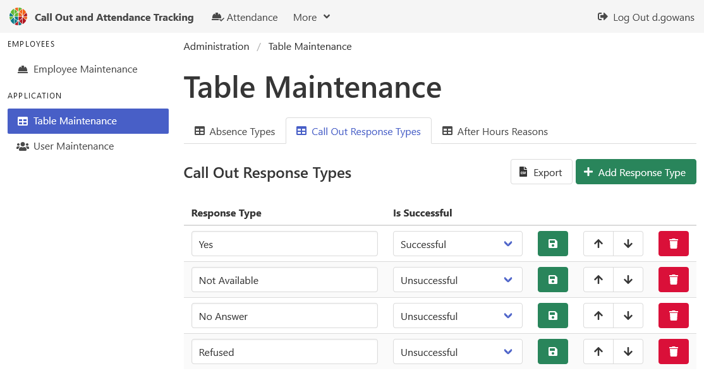

[Help Home](https://cityssm.github.io/attendance-tracking/docs/)

# Administrator Tools - Table Maintenance

The Table Maintenance page lets administrators add, configure, and remove drop list options.

## Important Note

⚠️ When renaming items, it is important to not change the meaning of the items as past records will adopt the new names.
When in doubt, delete the existing item, and create a new one.

## Related Administrator Tools

- [User Maintenance](admin-userMaintenance.md)
