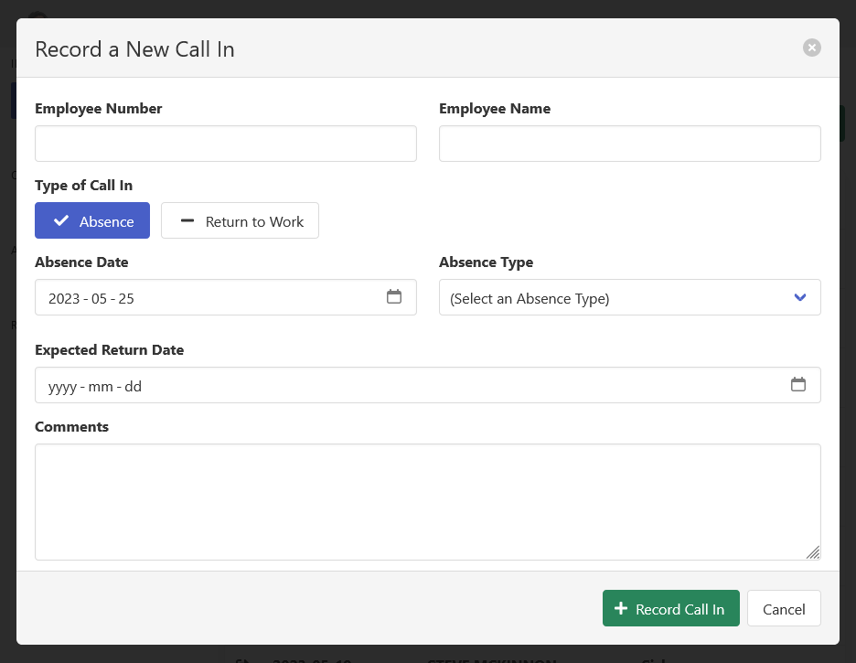
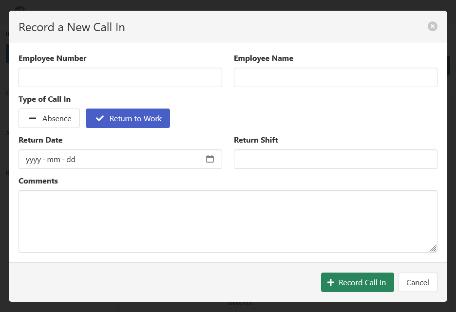
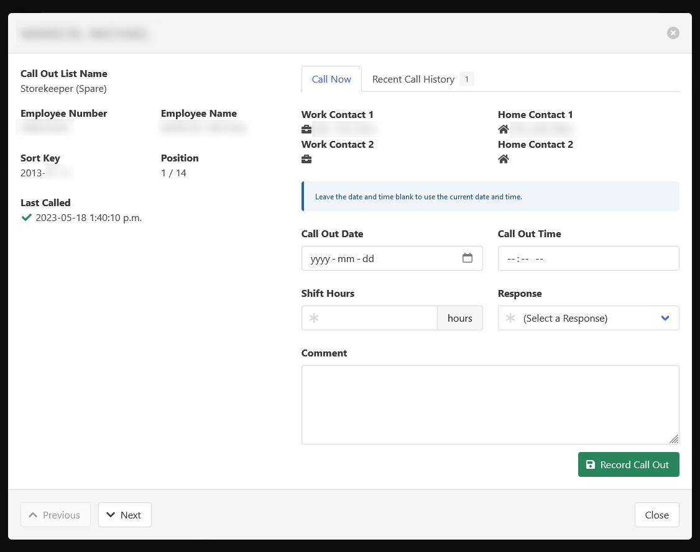
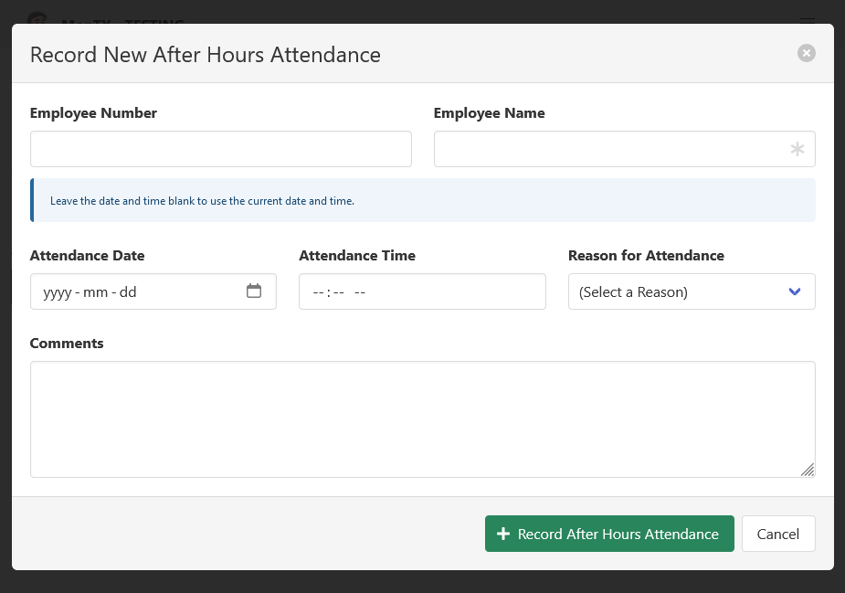

[Help Home](https://cityssm.github.io/MonTY/docs/)

# Employee Attendance

MonTY provides four tools to help track details associated with attendance variances.
Each tool can be disabled if it is not needed, and users can have varying permissions
within each tool.

Note that MonTY isn't meant to replace a payroll system that will ultimately determine
how an employee is compensated during an attendance variance.
It was developed with the following in mind.

- Give after hours watchpersons an organized way to record the employee calls
  they receive, without requiring access to the payroll system
  and without the use of easy to misplace sticky notes.

- Notify supervisors of employees that will not be showing up for
  their scheduled shifts.

- Provide managers with reporting options to identify habitual absences,
  and other attendance related issues.

## Absence Requests

Absence requests track last minute absence calls from an employee.
They can be used to record sick calls prior to a shift.

Absence requests record the following details.

- Employee Number
- Employee Name
- Absence Date
- Absence Type (Sick, Personal, Bereavement, etc.)
- Expected Return Date
- Comments

## Returns to Work

Returns to work track employees returning after an extended sickness or leave.

Returns to work record the following details.

- Employee Number
- Employee Name
- Return Date
- Return Shift
- Comments

## Call Outs

Call outs track employee responses to call out requests.

Each call out list tracks a list of employees ordered by seniority or other criteria
to ensure call out requests are made in the proper order.

Call out records track the following details.

- Call Out List
- Employee Number and Name
- Call Out Date and Time
- Shift Hours being offered
- Call Out Response (Yes, No, No Answer, etc.)
- Comments

## After Hours

After hours records employees accessing the workplace after regular work hours,
and the nature of those events.

After hours records track the following details.

- Employee Number
- Employee Name
- Attendance Date and Time
- Reason for Attendance (Called In, Tool Pickup, etc.)
- Comments
