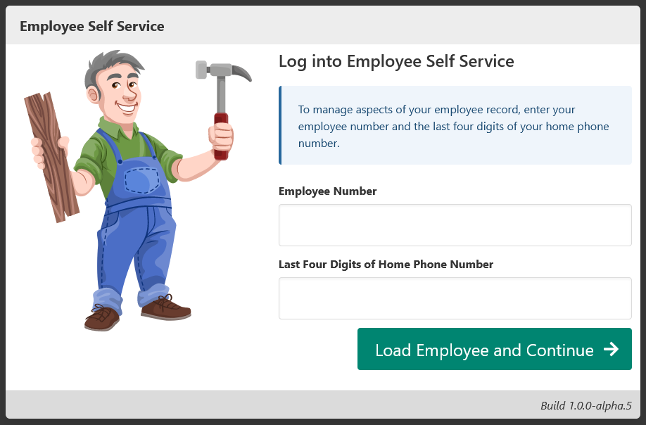
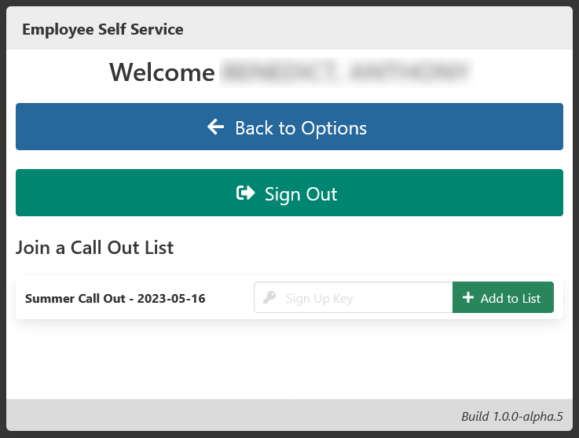

[Help Home](https://cityssm.github.io/MonTY/docs/)

# Employee Self Service

Attendance Tracking offers limited functionality to employees.

Employees log into the self service portal using their employee numbers
and the last four digits of their home phone numbers.

## Join a Call Out List

Employees can add themselves to call out lists when the following criteria is met.

- The call out list is open to **Self Sign Up**, an option set by the call out list creator.

- The employee is eligible to be on the list, based on the call out list's **Eligibility Function**.

Available call out lists may have an optional **Sign Up Key** associated with them.

This tool was built to handle weekend call out lists that change each week.
For example, a supervisor can create a self sign up call out list on Monday to track employees
available for call outs during the upcoming weekend.
Interested employees could add their names to the list at their convenience throughout the week.
On Friday afternoon, the list could be locked down and finalized.
