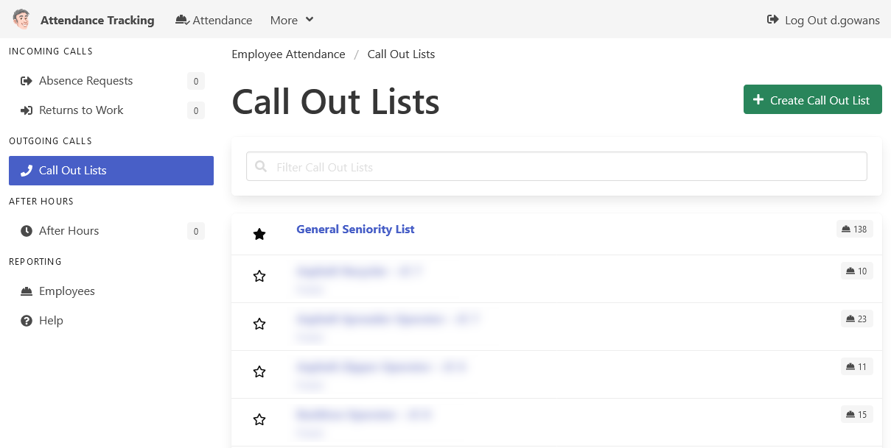

[Home](https://cityssm.github.io/attendance-tracking/)

# Help Documentation

**Thank you for taking the time to read the documentation.**

**[Employee Self Service](employeeSelfService.md)** 
An interface for employees to manage aspects of their employee records.

**[Employee Attendance](employeeAttendance.md)** 
Track absences, returns to work, call outs, and after hours attendance
all in one place.

## Administrator Documentation

**[Getting Started](admin-gettingStarted.md)** 
How to setup and start the application for the first time.

**[config.js file](admin-configJS.md)** 
How to use the configuration file to customize the application.

**[Logging into a New Install](admin-login.md)** 
How to activate the default admin user to access the application for the first time.

**[Administrator Tools - Table Maintenance](admin-tableMaintenance.md)** 
How to add, update, and remove drop list items.

**[Administrator Tools - User Maintenance](admin-userMaintenance.md)** 
How to add, update, and remove user accounts.
